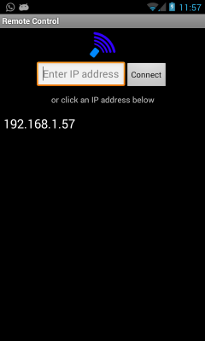
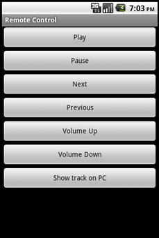

RemoteControl for Android
-------------------------

Copyright 2011 Christian Zommerfelds

 

Remote Control is a very small App and a library that allows the user to easily create a simple system where you can trigger actions in a server from your android phone via TCP/IP.

This project consists of two parts:
 * The Android Remote Control server library (Python)
 * The Android Remote Control client app (Java)

This software is licenced under the GNU GPL 3 (see COPYING.txt for more information)

